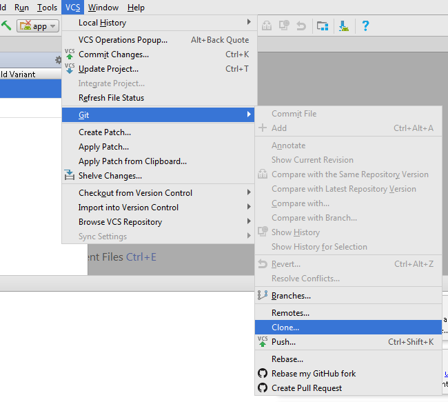
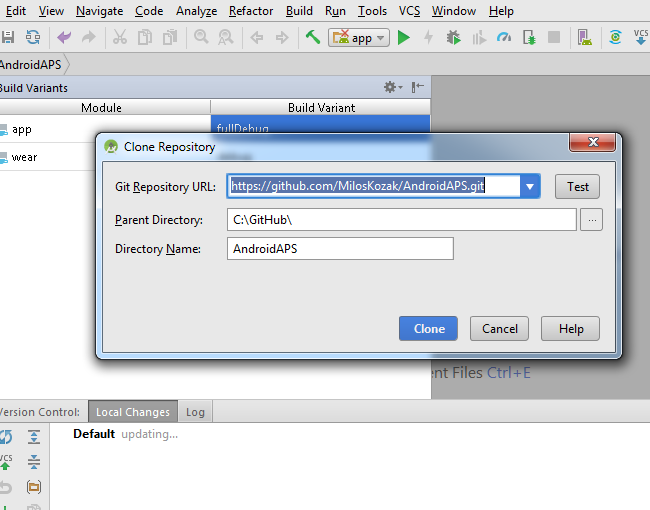
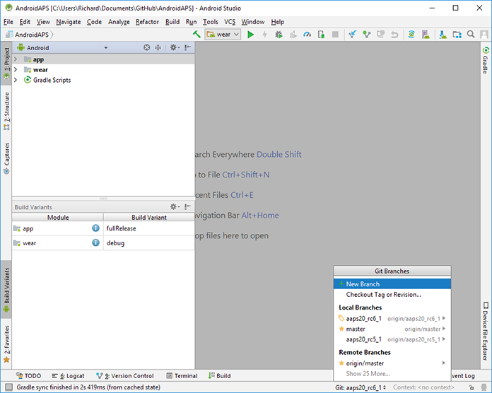
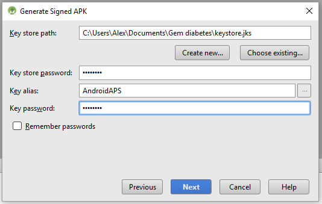

# Installing AndroidAPS - Build the APK

AndroidAPS and Ruffy come in the form of a source code that you have to download and compile using Android Studio. The process is not difficult once you have worked out what to do.

You will need to download a local copy of the source code folders (called a repository) onto your PC. There are a number of ways you can do this:

* **Install GitHub desktop** (recommended) on your PC. This will download the repository for you and automatically download any updates that occur in the future. 

* **Use the "clone" function in Android Studio** to download a copy of the repository directly into Android Studio. This works well but you will need to repeat the process each time there are future updates.

* **Download the repository as a zip file** and then unzip the folders and use those as the source for Android Studio. 

In all cases you will need to install [Android Studio](https://developer.android.com/studio/install.html). You will find instructions how to do this on their website. Once you have installed it you may find that it wants to install various updates - you need to do this.

We will look first at using the clone function in Android Studio, as per the following screenshot:

You then enter the URL of the repository you want to download. In this case AndroidAPS, but if you are using a Combo you will need to do the same process for Ruffy as well.

The URLs you need  are:
* [https://github.com/MilosKozak/AndroidAPS](https://github.com/MilosKozak/AndroidAPS)
* [https://github.com/MilosKozak/ruffy](https://github.com/MilosKozak/ruffy)

From here on the process is the same no matter which method you chose for downloading the repository.

* In Android Studio click on "File", select 'Open an existing Android Studio project' and select the location of the extracted files. You will also need to select which branch of the repository you want to compile. Normally this will be "Master".

* You might get an error message about not finding build tools - click on the links Android Studio provides to download all the suggested software updates.
 
* Go to Build Menu and click on Generate Signed APK

* Then under Module select "app":

* If this is your first time creating a signed .apk you will need to create a digital signature file, known as a keystore. If you already have a keystore then you can use that. For more information about using the keystore see [https://developer.android.com/studio/publish/app-signing.html#generate-key](https://developer.android.com/studio/publish/app-signing.html#generate-key)

Once you have created your keystore make sure you save it in a place where you can find it easily - you will need it again.

Having done that, click "Next" and you will get the following dialogue:

* Select the build type and flavor as shown in the screenshot.  Build Type = 'Release' should be your default choice. ('Debug' is just for people doing coding.)
* Select the flavor you want to build. Normally you need "full".

    * full (i.e. recommendations are automatically enacted in a closed loop)
    * openloop (i.e. recommendations are given to the user to enact manually)
    * pumpcontrol (i.e. basic remote control for the pump, no looping)
    * nsclient (i.e. Nightscout client, displays the loop data of another user and enables Careportal entries to be added)

*   Select V1 "Jar Signature" (V2 is optional) and click Finish. 

* The APK will now take some time to generate. You will get the pop-up below when the process is done.

* Click on 'Show in Explorer'. You'll find the APK is generated, sometimes it may take time to display. If you are having difficulty finding the .apk file you should find the AndroidAPS file at {yourfolder}\app\full\release\app-full-release.apk and if you are looking for the "wear" file for a watch you can look for {yourfolder}\app\release\wear-release.apk. It is a good idea to make copies of these files somewhere you can find them again easily. 

* You now need to copy the .apk files onto your phone and install them (just tap and follow the instructions). If you have not already done so you may need to set your phone to install .apk files from unknown sources. If you already have an older version of AndroidAPS on your phone that was signed with a different key then you will need to uninstall it first, but remember to export your settings first so you can reload them to the new installation.
