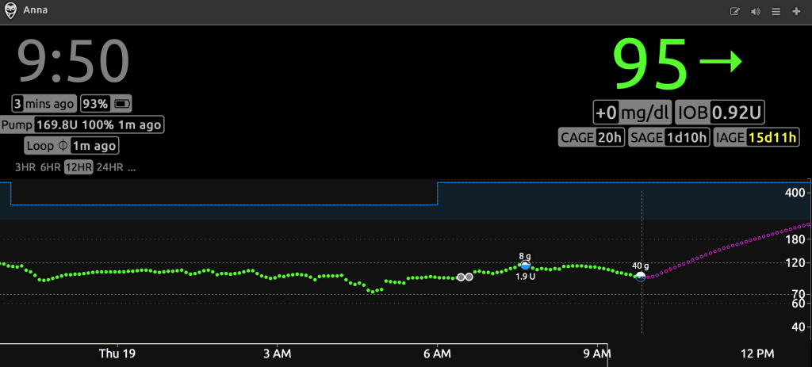
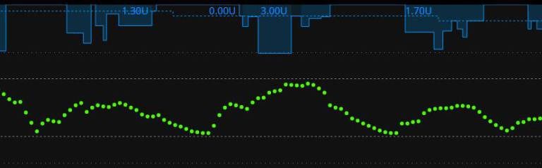
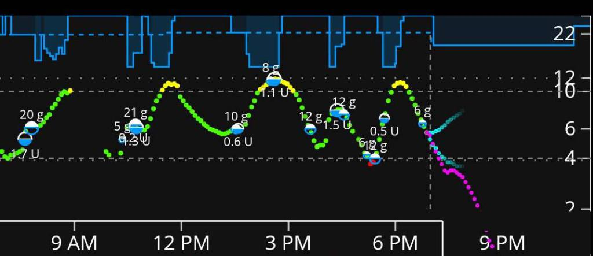
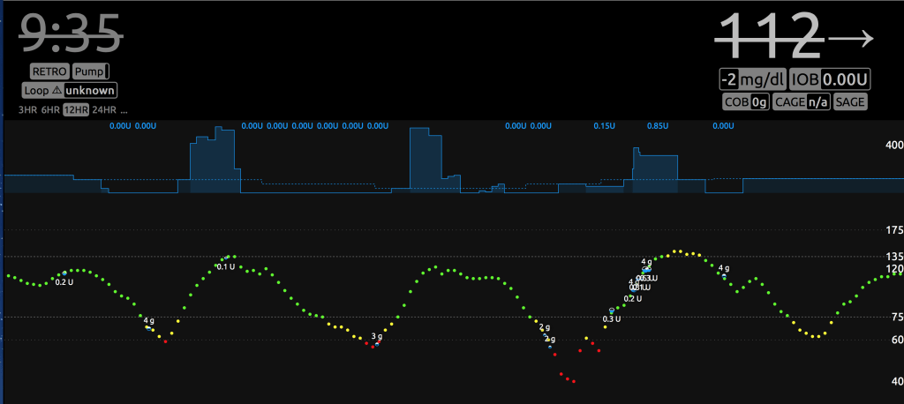
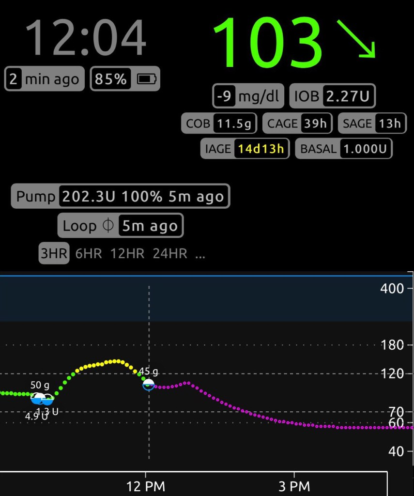
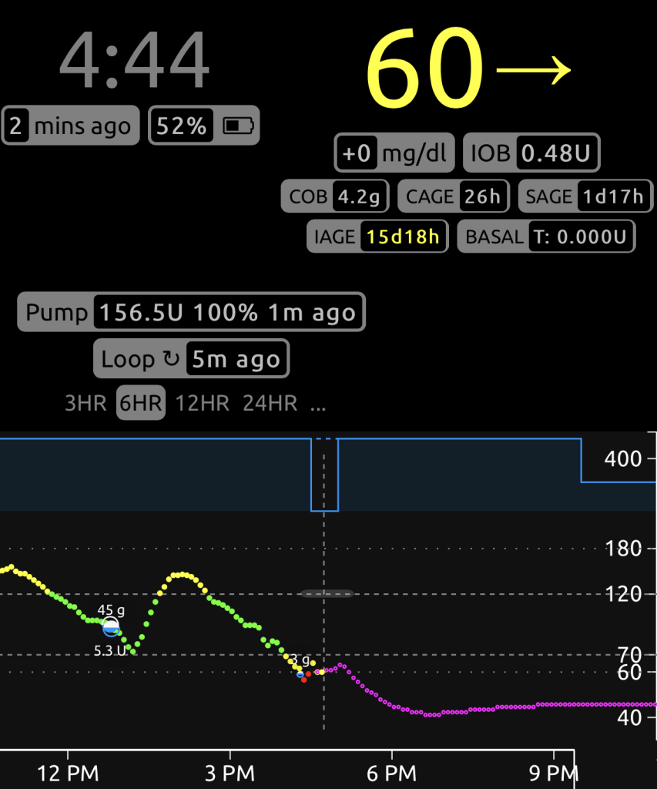
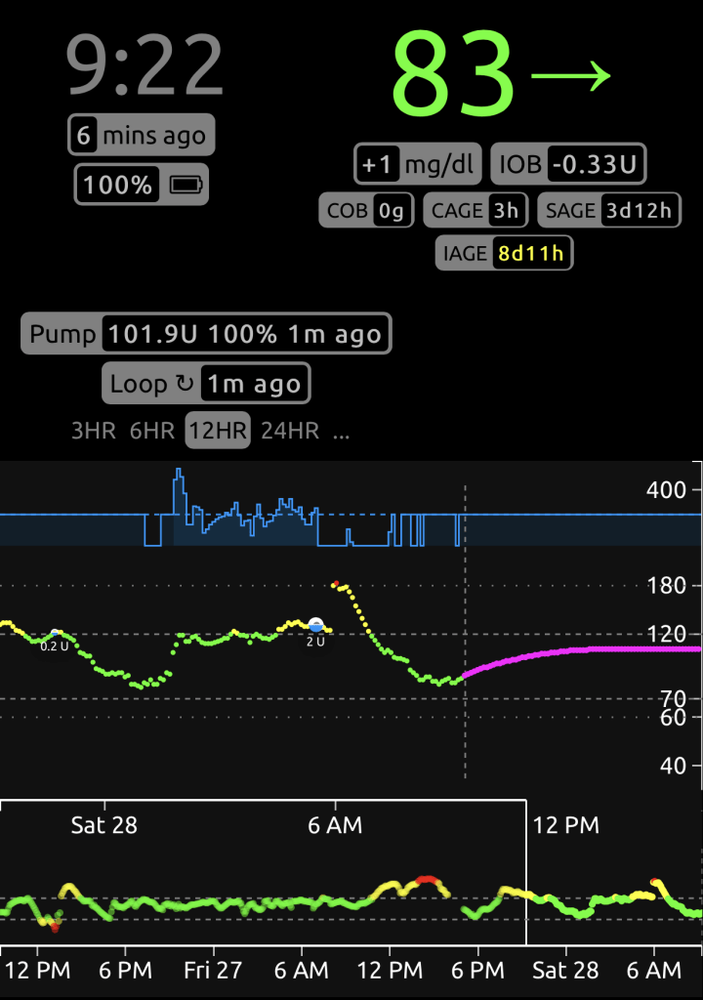
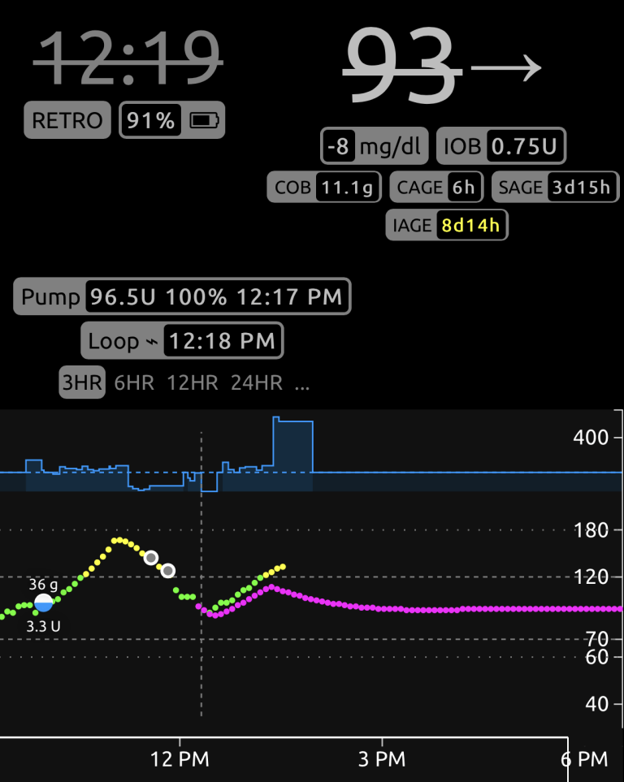
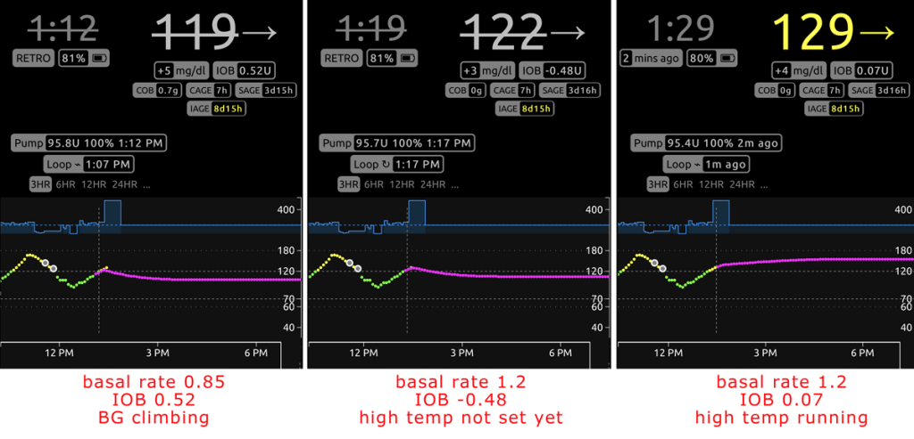
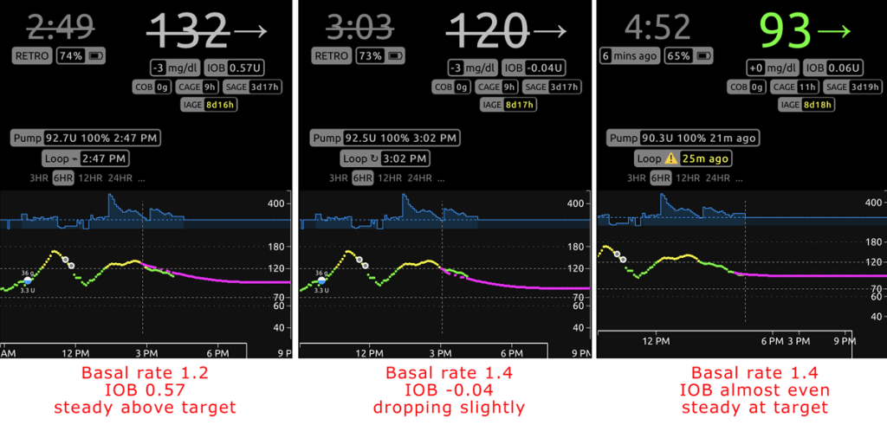

# Fine Tuning Your Rig

This is an adaptation of a blog article by Katie DiSimone. You can find the original [here](http://seemycgm.com/2017/10/29/fine-tuning-settings/)

It is totally true that there is no one place to read How To Adjust Your Settings in any looping documents.  The reason being…the answers are basically the same as other non-looping situations…test basals, test carb ratios, test insulin sensitivities.  The difficulty is that once people are already looping, nobody wants to turn off their loop to go and test settings again.  Everyone just wants to adjust settings on the fly while also keeping a closed loop.  So…I’ll try to explain a little of both methods.

Before we start, let me say this in case it isn’t obvious…I’m not your medical professional, nor anyone else’s medical professional.  Don’t take my words as a substitution for conversations with your doctor.

Ok…that warning provided… [Think Like a Pancreas](https://www.amazon.co.uk/Think-Like-Pancreas-Practical-Insulin-Completely/dp/0738215147) is a great reference for understanding some of the guiding principles in pump therapy.  Let me summarize the important parts:

Basal rates should keep your BGs steady in the absence of other influences (such as food, medications, etc).
Boluses should return your BGs to target after a meal.
ISF should be the amount one unit of insulin drops your BGs without other influences.
If you are new to looping, I recommend planning for a time to retest/reset all your assumptions about your diabetes settings.  Keep an open mind if you want to keep a closed loop. (how’s that for a catch phrase?)

It is absolutely possible to have two wrong settings look like a right setting when they balance out.  The problem is that those wrong settings won’t balance out in all situations.  Example:  Too low of basals can be offset by regular eating of meals with too strong of a carb ratio.  If you stop eating though, you’ll start going high because that extra insulin from the meal boluses won’t be there to help the lack of basals.  Taking the time to validate your settings by truly testing them is really good practice.

## 1st: Insulin Duration

New loopers’ number one settings issue will likely be too short of a duration of insulin action (DIA).  Almost all of us have cut our DIA at about 3 hours on traditional pump therapy.  There’s a reason for that.  In traditional pump use, DIA is only used to calculate the remaining IOB at any given time after a bolus.  That’s it.  And when do we use remaining IOB in traditional pump therapy?  Usually when we want to give a correction because a BG is stuck high or going low…in other words, DIA is used as a rough approximation to correct off-target BGs.  It doesn’t have to be rocket science then…we’re making an approximation because some other numbers (carb count, basals, etc) weren’t behaving the way we were expecting either and therefore leading to an off-target BG.

But in looping, DIA (and its related IOB) plays a HUGE part in how the loop is anticipating and evaluating your BG movement.  IOB is used literally every single minute for every single loop calculation for where to go next in setting a temp basal or providing a bolus recommendation.

Not only that, but the STRENGTH of the insulin at any given time is also being used.  Closed-loops know and care about whether your insulin was given recently and is due to peak soon (like between 60-90 minutes with novolog/humalog), or if it is in the slow tail portion hours later where BG impacts are going to be way less dramatic.  So, DIA means a lot in your closed-looping world.

What will happen if you use too short of a DIA in closed-looping?  You’ll see it in a variety of ways, but too short a DIA will give the equivalent of insulin-stacking.  The loops will be assuming insulin is disappearing faster than it actually is.  If you are getting steady BGs while closed looping with a short DIA, it’s likely that your basals are being set too low to compensate.  If instead you have your basals correctly set and use a short DIA in closed-looping, you will likely find yourself going low from corrections.  One good indication of this is going lower than target carrying negative IOB from previous loop low/zero temp basals.

General recommendation:  Set your DIA to 5 or 6 hours for novolog/humalog, do not keep using your old, short DIA from traditional pump therapy days.  If you are using the newest versions of Loop or OpenAPS, the code is defaulted for 6 hours.  Test your basals (see below) with the new longer DIA and make sure that you can get steady BGs with the new basals.

## 2nd: Basals

Now that you have a reasonable DIA set, make sure to test your basals.  Personally, we find testing basals can be pretty painless and doesn’t require days of fasting.  Instead, we look for easy opportunities.  If you are willing to open-loop test, that is going to give the most accurate information in the quickest way.

It’s a pretty easy test.  Turn off your loop.  Don’t eat food, don’t do crazy exercise, don’t sit in a hot tub.  Just have a relaxing average time period and see if your basals are able to hold you roughly steady.  Doesn’t matter if you are at target or not…the idea is to simply have zero extra insulin on board from any boluses or corrections and watch what happens during those hours.  Typically we like to see about two hours of BGs without the influence of food boluses.

Believe me when I say that Anna is not enthusiastic about fasting basal testing…so I look for opportunities to make it less cumbersome.  For example, use a meal that I know like the back of my hand how to bolus for it and that generally needs no corrections.  For us…that’s two extra large scrambled eggs (or three small ones) with cheese bolused at 8g.  If she eats that meal, the BG response is slow and measured and by 3 hours after that meal…the bolus and food effects are really muted and we can start watching to see if BGs stay pretty steady for the next two hours.

For example, here’s some of a recent open-loop basal testing we did with Anna…confirmed that the BGs could stay pretty steady without the involvement of temp basal help from looping.  The 8g of eggs at the end of almost 3 hours…looks like she went a little lower (and may have deceased even more if she hadn’t started the next meal) than she had started.  Since basals appeared to be keeping her pretty steady, I made a mental note that carb ratio might be just a touch too strong, but didn’t adjust right away.  I waited to see how the next meal was going to behave.

If you absolutely don’t want to turn off your closed loop to test this…see if you can find a time where BGs are steady, you are at/close to target, and you are not carrying positive or negative IOB.  If you can’t find a time like that, chances are you may need to adjust settings.  Nighttime is usually the easiest to find that…but having well-set nighttime basals does not mean that daytime is also necessarily well-set.  That needs to be tested as well.

## 3rd: Insulin sensitivity factor

Insulin sensitivity factor (ISF) is the next logical setting to test.  If you’ve just done the basal test and gotten steady BGs with an open loop…try taking a glucose tab or two.  Wait for your BGs to be steady at the higher BG, and give a safe correction that you think will get you close to target.  Watch the resulting BG drop over the next 2-3 hours.  You should see BGs come to a steady level again.  How much did the BG drop?  How many units of insulin did you use?  Divide the two numbers and you will have your ISF.  If your BG dropped 15 mg/dl with half unit of insulin, your ISF is approximately 30 mg/dl/unit.

In the context of a closed loop ISF  affects how strongly the loop responds to deviations from target. If your ISF number is too high then it won't respond strongly enough to bring you back into line. Too small a number and the response will be too strong and it will oscillate between zero temping and high temp basals. And you'll see a fluctuating BG as a result.

If your ISF number is too low (the insulin is having a bigger effect than the number would suggest), one of the most common symptoms you’ll see is a roller coaster of BGs where the temp basals are cycling between zero and high temping.  I’m going to borrow a couple of example graphs from Looped group.  These are examples where too low an ISF (ISF number too small) is more than likely a large factor in the roller-coaster (doesn’t mean it is the only culprit, and is more difficult to ferret out when food is involved like the second graph).  But, lightning bolt high temp basals followed by very quick BG drops and zero temps is usually too low an ISF… raise the ISF number to help looping know that each unit of insulin is actually doing more BG dropping.

## 4th: Carb Ratios

Now that you have basals, ISF, and DIA all set-up…here’s where it gets really tempting to close loop and move on.  And, truthfully, it’s not that hard to test carb ratios on a closed loop vs an open loop if you’ve solidly tested all these other factors.

A good carb ratio will bring your BGs back to the starting point of the meal within about 3 hours or so.

A bad carb ratio will leave you higher or lower than the starting point of the meal.

For example, these are two examples of carb ratios being too strong.  In this first example, there’s 2.27 units of IOB and BGs are at 103 and headed down at a pretty good clip at about 2 hours after the meal.  If the next meal hadn’t been eaten then, low treatment certainly would’ve been needed.

This next graph also shows too aggressive of a carb ratio.  Three hours after the meal, there’s nearly 0.50 units IOB, BG is well below where the meal started, and definitely low treatments needed.

If you are finding that a correct carb ratio is yielding good BGs 3 hours later, but you aren’t happy with the peak BGs during the meal…then it may be time to explore increasing or adding prebolusing time to your meal or implementing “eating soon” targets an hour before meals to help control the post-meal BG spike.  Artificially strengthening carb ratios to help control post-meal BG spike will likely yield lows 2-3 hours after a meal.

## But what about diabetes?

Of course, as soon as you test and dial-in all these things, diabetes will throw you a curve ball and change your insulin needs.  That’s the way it works.  It’s not just YDMV (your diabetes may vary), it’s actually YDWV (your diabetes will vary).  So how do you adjust settings without needing to open loop every time?  Short answer: it takes practice.

For us personally, hormones play the largest variable in settings.  If we estimate average basal rate of about 1 u/hr for Anna, hormones can make her range from 0.55 to 3 u/hr.  Illness or heat can make her ISF change from typical 35 to a range between 30-45.  We have gotten used to changing settings (basal rates mostly) to accommodate hormone fluctuations.  Illness and heat we tend to use shorter-term fixes like temp targets to help rather than changing settings.

One of the easiest tells we have that basals need to change is hanging out above/below target with positive/negative IOB.  Here’s one recent example.  During the day before this screenshot, Anna was busy with some stressful things at school…like being front and center during the school’s pep rally for Homecoming around noon to 2pm.  So, the unusual red spot on her graph didn’t immediately make me think anything was “wrong”.  Then she went to Homecoming dance that night, hung a little higher than target, but nothing too bad and she wasn’t looping during dance (her choice).  She came home around midnight, and at about 5am I noticed that she was hanging out steady at about 130s and carrying positive IOB.  Fingerstick showed she was at 195 (thanks Dexcom).  Gave a correction and started to wonder if may her basals were too low, because she shouldn’t have been that high under normal operations (but maybe homecoming dance was to blame?).  I didn’t make any changes to her settings at this point, but did start to watch for signs.

In the morning, Anna had a typical breakfast with some toast and fruit.  With fiasp, she hasn’t really been going above 150 (and usually not above 130)…so when she hit nearly 180 for the meal, I definitely started to think basals may indeed be low…but I waited to see how the meal would land.

As you can see above, about 2.5 hours after her meal of fairly quick carbs, she started to rise.  And she started to rise with about 0.75 units IOB.  This is odd for her.  Ideally, we wouldn’t be seeing sharp, steady rises with a good amount of IOB.  Additionally, this meal didn’t have protein or fat involved so I knew the rise wasn’t a late food contribution (even if Loop had some cob still on board).

So, once it looked like (1) the rise really wasn’t slowing down even like Loop thought it should, (2) she was climing with fiasp for nearly an hour of high temping with (3) positive IOB…then I finally decided to adjust basals.  I moved her basals from 0.85 to 1.2 u/hr.  Why that number?  A guess based on basal rates she tends to move between during her regular variations.  Trial and error have shown us that a rate slightly above 1 u/hour is usually needed sometimes.

One of the things I like to watch is the IOB pill when we make a basal change.  Ideally, I like to get the IOB back to a number that is roughly how much I think may help get a correction going again.  So, changing the basals from 0.85 to 1.2, Loop recalculated IOB from 0.52 to -0.48.  Which was roughly in line with what I’d expect…Anna was about 27 mg/dl over her 95 mg/dl target with an ISF of 55…meaning she’d need about 0.49 units to correct to target.  Perfect…seemed like a reasonable amount of movement for basals then.  Loop started running a high temp and I wait to see how things look in about 2 hours.

About 1.5 hours later, Anna wasn’t quite coming down as fast as I would’ve expected. She was still holding 0.57 IOB and at same BG as she was 80 minutes before.  So…I waited a bit and adjusted again to 1.4 u/hour.  Again, just a guess, but nearly two hours after that adjustment we are sitting just about at target and just about even IOB.  I’ll probably split the baby and use 1.3 u/hr going forward.

So…that’s how I look for and make tweaks to my settings while closed looping.  The basis is knowing what “good” times look like and how foods normally behave.  Open-loop testing really helps with that.  Then, when you find yourself with some of the telltale signs (food going differently than expected, BGs holding steady but not at target, moving up/down without IOB helping, etc) over an extended period of time, you can make small adjustments and watch for the resulting behaviors.  I don’t adjust based on just one meal or one period of above-target BGs.  There’s too often another reason (stress, sensor issues, etc) that could explain a short term high/low BG pattern…but if I notice the trend continuing for a period of time/several meals, I adjust.  Shorter term issues from stress or exercise we deal with using temp targets or just have a little more patience and wait for them to come down when the issue has passed.