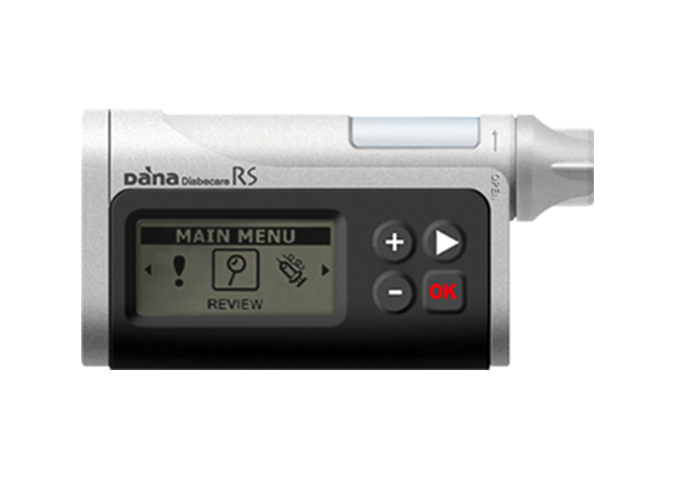

# Pumps compatible with AndroidAPS

Currently with AndroidAPS you essentially have the choice of two insulin pumps, the Roche Spirit Combo and the SOOIL Dana* R or RS. 

## Roche Spirit Combo

The Combo is a widely available pump and all versions of it can be used for looping with AndroidAPS. You will need to install a special driver on your phone known as Ruffy which emulates the Combo handset and issues the appropriate commands via Bluetooth. This makes it somewhat slow to transfer commands to the pump but that's not a problem in this situation.

Due to the vagaries of the version of Bluetooth on the Combo you will have to use a phone running either Android 8.1 or an older phone which has LineageOS 14.1 installed. (LineageOS is an alternative verson of Android and is widely and freely available.)

You will also need to alter some of the settings in the configuration of your pump. This is quite simple and requires an infrared cable and some configuation software both available from Roche or can be purchased online fairly cheaply. Or if you join one of the AndroidAPS facebook groups you will likely be bale to borrow one.

The Combo is a good solid pump, reliable and free of unnecessary frills. It also uses readily available size AA batteries - or equivalent rechargeables.

## The SOOIL Dana* R or RS

The Dana* RS is an upgrade to the Dana* R and both have been designed with remote operation via Bluetooth in mind. Pairing the pump with your phone is easier with the Dana* pumps and no modifications to the phone's operating system are required. Because of this commands are transferred more rapidly to the pump so it may seem more responsive to the user.

Details of the various distributors for these pumps is in [this spreadsheet](https://drive.google.com/open?id=1CRfmmjA-0h_9nkRViP3J9FyflT9eu-a8HeMrhrKzKz0), please share the details of yours if not already listed.

It is possible that other pumps will join the list in due course - but at this point these are your only choices.

